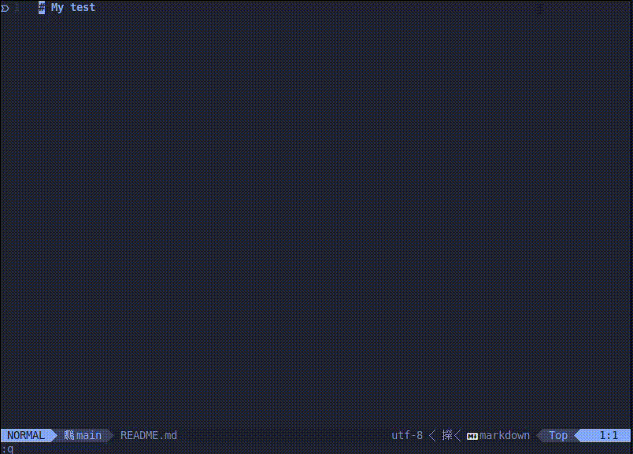

# Committer

If you are a developer working in multiple projects, you probably use
a different commit standard per project ([conventional](https://www.conventionalcommits.org/en/v1.0.0/) or [gitmoji](https://gitmoji.dev/)).
This plugin allows you to set a commit standard per project and then just
use `<leader>m` to choose a commit prefix without worrying about the standard.
This project is based on [telescope-gitmoji.nvim](https://github.com/olacin/telescope-gitmoji.nvim) and [telescope-cc.nvim](https://github.com/olacin/telescope-cc.nvim).




## Getting Started

Install with lazy.nvim:

```lua
{
    'JosephPenaQuino/committer.nvim',
    config = function()
        require("committer").setup()
    end,
    dependencies = {
        'nvim-telescope/telescope.nvim',
        'olacin/telescope-gitmoji.nvim',
        'olacin/telescope-cc.nvim',
        'nvim-lua/plenary.nvim',
    },
}
```

## Usage


Open your git project and run:

```vim
:SetCommitType
```

Then, write `conventional` or `gitmoji`.

After that, when writing a commit message, use `<leader>m` to choose a commit
prefix.
